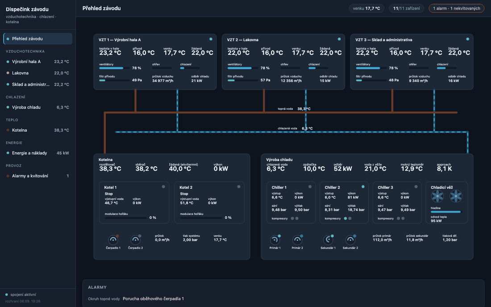
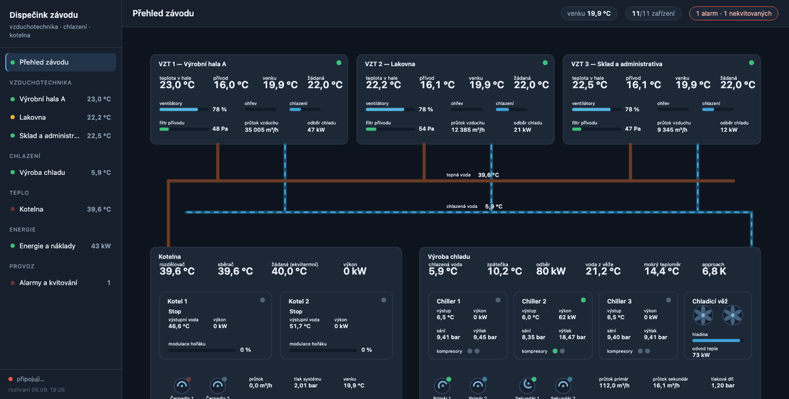
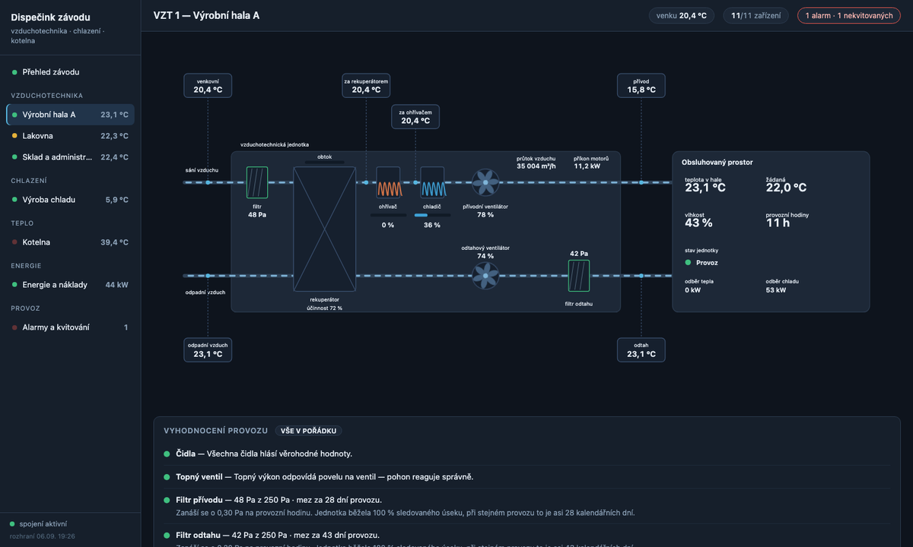
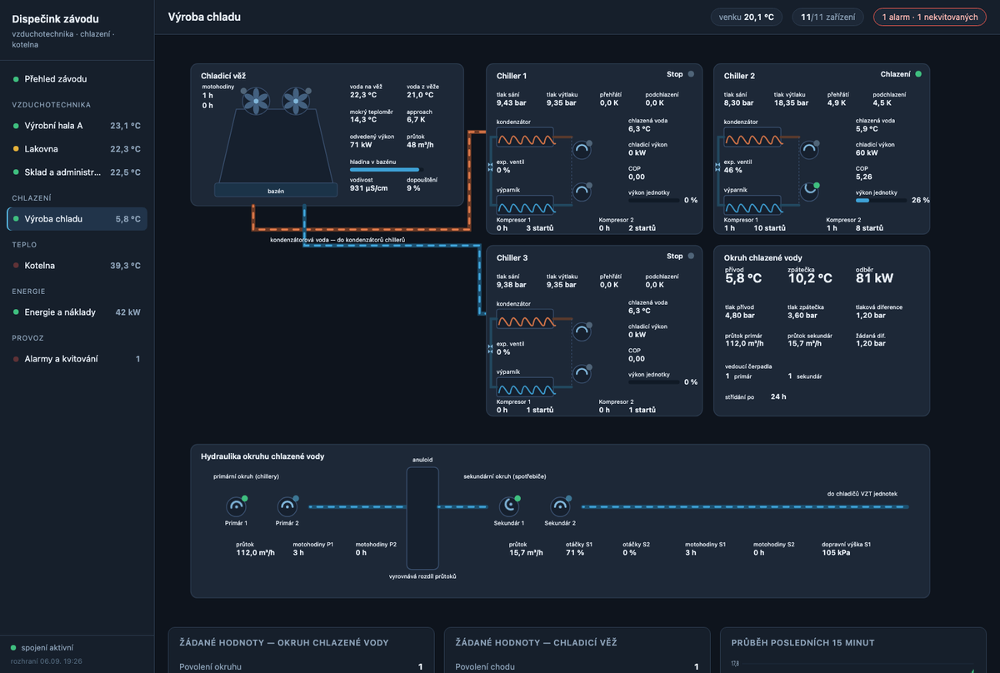
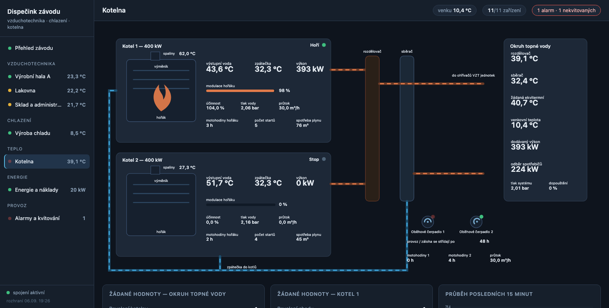
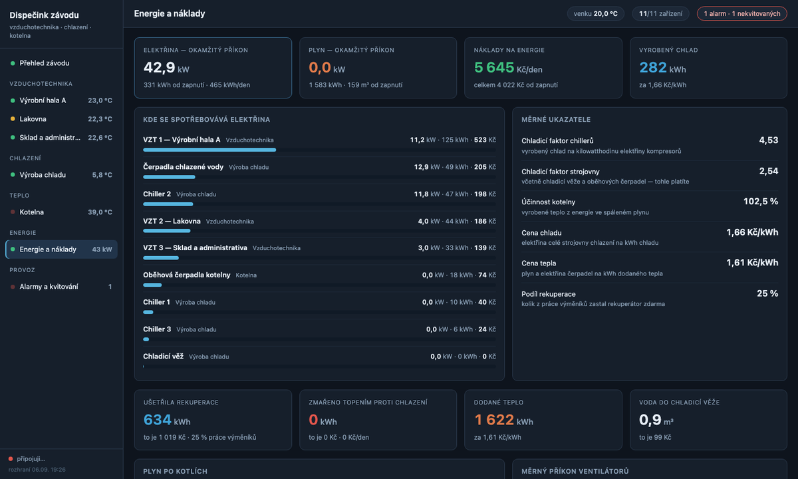
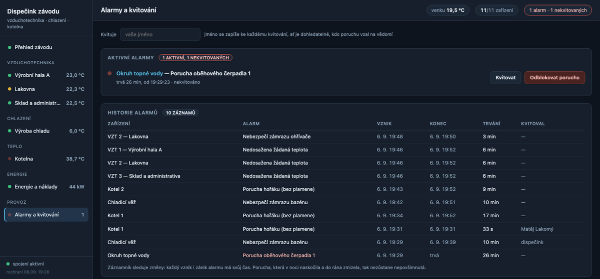

# Factory HVAC Visualisation and Monitoring

*[Česká verze](README.md)*



Simulation and monitoring of the mechanical services of a fictional
manufacturing plant. Every device talks **Modbus TCP** — just like the
controllers in a real switchboard. On top of them run data collection into
SQLite and operational analysis.

The project is a demonstration of how building management is actually done:
the register map kept separate from the code, data collection that survives
a dropout, analysis grounded in the physics of the equipment, and a
visualisation you can actually read the plant from.

## What the plant contains

| Device | Description | Modbus |
|---|---|---|
| **AHU 1** | Production hall A — 45,000 m³/h, heat recovery, water heater and cooler | `127.0.0.1:5021` |
| **AHU 2** | Paint shop — 16,000 m³/h, low heat recovery, fast-clogging filters | `127.0.0.1:5022` |
| **AHU 3** | Warehouse and offices — 12,000 m³/h | `127.0.0.1:5023` |
| **Chiller 1–3** | Chillers, two compressors each, refrigerant pressures, running hours | `:5031–5033` |
| **Cooling tower** | 2 fans, wet-bulb temperature, approach, make-up and blowdown | `:5034` |
| **Chilled water circuit** | 2 primary + 2 secondary pumps (duty/standby), flows, pressures | `:5035` |
| **Boiler 1–2** | 400 kW condensing gas boilers, modulating burner | `:5051–5052` |
| **Boiler room** | Header and collector, weather compensation, 2 circulation pumps | `:5053` |

The devices are not independent islands — they are connected the way heat
actually flows through a plant:

```
weather ─► 3× air handling unit (each its own hall and control loop)
              │ cooling drawn          │ heat drawn
              ▼                        ▼
       chilled water circuit    heating water circuit
              │ return                 │ return
              ▼                        ▼
         3× chiller                2× boiler
              │ waste heat
              ▼
       cooling tower ─► outdoor air
```

When a cooling valve opens in the paint shop, the chilled water return warms
up a moment later, another compressor starts, and a second tower fan spins up.

## Running it

```bash
pip install -r requirements.txt

python simulator.py          # the plant on Modbus TCP (11 devices)
python -m web.server         # dispatch console at http://127.0.0.1:8000
python poller.py             # archives data into data.sqlite
```

The console reads the devices over Modbus itself, so it works without the
poller. The poller runs alongside as an archive — after a restart the console
loads recent history from it so the operational analysis does not have to
start from scratch.

The simulation runs on an accelerated clock — the default `--speed 60` means
one real second is a minute of plant operation, so a daily cycle completes in
24 minutes and running hours accumulate visibly.

```bash
python simulator.py --season leto      # hot day, chillers and tower flat out
python simulator.py --season zima      # boiler room at full load, cooling idle
python simulator.py --speed 300        # faster clock
python plant.py                        # prints the device list and ports
python poller.py --device vzt1 --once  # one reading from one device
```

Seasons are `zima` (winter), `jaro` (spring), `leto` (summer), `podzim` (autumn).

### Faults for testing the analysis

```bash
python simulator.py --fault vzt1:stuck-valve --fault chw:p1 --fault vez:fan1
```

| Device | Fault | What happens |
|---|---|---|
| AHU | `stuck-valve` | heating valve actuator jams — heats even at 0 % command |
| AHU | `sensor-fail` | supply sensor reads −120 °C, control falls back to a substitute |
| AHU | `fan-fault` | supply fan failure |
| Chiller | `comp1`, `comp2` | compressor fault, unit runs at half capacity |
| Tower | `fan1`, `fan2` | fan failure, approach rises |
| Chilled water | `p1`, `p2`, `s1`, `s2` | pump fault — standby takes over without losing flow |
| Boiler room | `hp1`, `hp2` | circulation pump fault |
| Boiler | `burner-fault` | burner will not start, cascade switches to the other boiler |

Faults given with `--fault` are permanent causes — acknowledging will not
remove them, and the fault comes straight back. A burner lockout after a
failed ignition happens on its own and can be acknowledged.

## The visualisation

The console is a single-page application: the schematic is assembled once and
from then on only values flow into it over a WebSocket, once a second. Nothing
is redrawn, so fans spin smoothly and you can see which pipes are carrying
medium right now.

```
 ┌────────┐  Modbus TCP   ┌────────────┐  WebSocket  ┌─────────┐
 │ device │ ◄───────────► │   server   │ ◄─────────► │ browser │
 └────────┘  read every 1 s└────────────┘  state 1 s └─────────┘
```

**Plant overview** — process schematic with the three air handling units, the
heating and chilled water mains, the boiler room and the refrigeration plant.
Each block opens its own detail.



**Air handling unit detail** — the air path from intake to exhaust with sensors
where they belong, heat exchanger, heater and cooler with valve positions,
filters that change colour as they clog, and setpoint sliders that write back
into the unit.



**Refrigeration** — the refrigerant circuit of every chiller (condenser,
compressors, expansion valve, evaporator) with pressures, superheat, running
hours and start counts; the cooling tower with its approach and water
treatment; the circuit hydraulics with the low-loss header and pump pairs.



**Boiler room** — both boilers with burner, flue gas and modulation, header and
collector, circulation pumps and weather-compensated control.



**Energy and cost** — where electricity and gas are consumed, what a produced
kilowatt-hour of heat and cooling costs, and what heat recovery saves.



**Alarms and acknowledgement** — what is alarming right now, with buttons to
acknowledge and to reset, plus the history: when an alarm was raised, when it
cleared, how long it lasted and who acknowledged it.



## Energy and cost

Heating and cooling swallow most of the money in a plant like this, but it is
usually impossible to break the figure down by device. The console therefore
computes an energy balance from the sub-metering counters the devices report in
their registers — electricity meters on fans and compressors, a gas meter on
the boilers, heat meters for heating and cooling. The counters only ever
increase and are never reset, exactly like a real meter; consumption over a
period is the difference between two readings.

The **Energy and cost** screen shows:

**Where it is consumed** — electricity broken down by device with instantaneous
power, consumption and cost. Without the breakdown nothing can be improved: a
single figure for the whole plant only tells you that it is large.

**Specific indicators** — the numbers you can compare month against month:

| Indicator | What it says |
|---|---|
| Chiller COP | cooling produced per kWh of compressor electricity |
| Plant COP | the same including tower and pumps — this is what you pay for |
| Boiler room efficiency | heat produced from the energy in the gas burned |
| **Cost of heat and cooling** | what a produced kWh costs — in money, not percent |
| Heat recovery share | how much of the coils' work the exchanger did for free |
| Specific fan power | kW per m³/s delivered; rises as filters clog |

**What is leaking away** — how much heat recovery saved, and how much was
wasted when a unit heated and cooled against itself. Wasted heat is paid for
twice: first it is produced, then the cooler has to remove it, so it is priced
at the sum of the cost of heat and the cost of cooling. This is the direct
continuation of the stuck-valve diagnosis — there you learn the valve is
leaking, here you learn what it costs per day.

Energy prices live in one place in `plant.py` (`TARIFFS`); on a real job you
overwrite them with the rates from the invoice.

## Alarms, acknowledgement and the log

The alarms a device reports in its bit word are an instantaneous state. That is
not enough for an operation: a fault that appeared at night and cleared by
morning is not on the display any more — and yet it happened. The console
therefore watches CHANGES. Every alarm raised opens a record, clearing it fills
in the end time, and acknowledgement is a third, separate field.

### Acknowledging and resetting are two different things

| | What it does | Touches the device? |
|---|---|---|
| **Acknowledge** | records who took notice of the fault, and when | no |
| **Reset fault** | clears the latched fault so the machine may start | yes, writes to a register |

The difference matters. Acknowledgement is for traceability — the alarm stays
as long as its cause does. Resetting is an intervention in the device and goes
over Modbus.

### Faults latch

A real machine does not restart itself after a fault, even once the cause is
gone — the motor protection stays tripped until somebody acknowledges it. The
model does the same:

```
fault    the external cause (overload, lost phase, seized rotor)
latched  the remembered fault, waiting to be acknowledged
```

Acknowledging forgets the fault. If the cause is still there it comes straight
back — acknowledging without fixing the fault does not help in the field either.

The boiler shows this best: when ignition fails (rare on a healthy burner, and
the model accounts for it) the burner locks out and will not restart on its
own. The cascade meanwhile picks up the load with the second boiler, so the
header holds its temperature, but until somebody comes to acknowledge it the
boiler room runs at half capacity. That is exactly why people are sent to the
boiler room to acknowledge faults.

### Chatter filtering

An alarm is recorded only once it has persisted for a set time, and cleared
only once it has been gone for a set time. Without that the log fills up with
one-second chatter at the edge of the control band: "setpoint not reached"
appears and disappears ten times a minute on a boiler sitting at the limit. In
testing this was the difference between 35 records in two minutes and three —
and those three were real faults.

How long each alarm must persist is stated next to its description in
`registers.py`. A machine or sensor fault is reported immediately, a deviation
from setpoint only after a minute.

The log lives in its own database, `alarms.sqlite`, separate from the
measurement archive the poller writes — one file, one writer.

## Operational analysis

For the air handling units the analysis does not rest on a threshold on a
single value — the controller already does that through its alarms. The checks
follow the COURSE of several values over time, and so they catch things a
single reading cannot show:

| Check | What it rests on |
|---|---|
| **Supply and extract filter** | pressure drop trend → when it reaches the replacement limit |
| **Heating valve** | heat output against what the valve position allows |
| **Heat recovery** | efficiency computed from measured temperatures against design |
| **Air path** | airflow against what the fan speed implies |
| **Sensors** | values outside the physical range (open or shorted circuit) |
| **Hall temperature** | deviation from setpoint, and whether the unit ran out of capacity |

Findings come at three levels (to act on / to watch / in order) and feed the
status dot next to each device in the sidebar, so nobody has to walk the
screens. When there is no data for a check it says so — it does not claim
everything is fine.

### The time axis: running hours, not the calendar

The filter clogging forecast is computed against the device's **running
hours**, which it reports in its own register. A filter clogs as the fan runs,
not as time passes — for a unit working one shift a day, a calendar trend would
be wrong by a factor of two. A calendar estimate is then derived from how much
of the observed period the unit actually ran.

If the running-hours counter jumped backwards (controller replaced, device
restarted), the analysis uses only the section after the jump. Otherwise the
fitted line would mean nothing.

### Examples of what the checks catch

```bash
python simulator.py --fault vzt1:stuck-valve   # heats even when told to close
python simulator.py --fault vzt3:sensor-fail   # supply sensor reads -120 °C
```

A stuck valve is caught even when the control never asks it to close: the heat
output is higher than the valve position physically allows. The inequality
`heat output ≤ heater capacity × valve command` always holds — the heating
water temperature can only pull the output down, never up.

Control is bidirectional: a slider writes the setpoint into the device over
Modbus, and the schematic immediately shows how the plant responded.

### Server interface

| Path | What it does |
|---|---|
| `GET /` | the visualisation |
| `GET /api/meta` | device list, quantities, units, states and alarms |
| `GET /api/state` | current state of every device |
| `GET /api/history/{id}?keys=…` | the last 15 minutes, for trends |
| `GET /api/diagnostics/{id}` | operational analysis of one device |
| `GET /api/energy` | energy balance and cost |
| `GET /api/alarms` | active alarms (`scope=active`) or history (`scope=history`) |
| `POST /api/alarms/ack` | acknowledge — records who took notice of the fault |
| `POST /api/alarms/reset` | reset a fault by writing to the device register |
| `POST /api/write` | write a setpoint `{device, key, value}` |
| `WS /ws` | the state of the whole plant, once a second |

## Layout

```
plant.py        the device list — what stands where and on which port
registers.py    Modbus register maps for every device type
simulator.py    a Modbus TCP server for each device
poller.py       data collection from all devices into SQLite
diagnostics.py  operational analysis from the course of the values
energy.py       energy balance, specific indicators and cost
alarmlog.py     the alarm log with chatter filtering and acknowledgement
web/
  server.py     the console: Modbus -> WebSocket, setpoint writes
  static/
    index.html  the application shell
    screens.js  process schematics for every screen
    app.js      connection, navigation, filling the schematics with values
    style.css   the look of a control room screen
sim/
  common.py     PI controller, motor model, duty/standby pair, sequencer
  factory.py    the coordinator — connects the plant and computes the weather
  ahu.py        air handling unit
  chiller.py    chiller with its refrigerant circuit
  tower.py      cooling tower
  chw.py        chilled water circuit with a low-loss header
  boiler.py     gas boiler with a modulating burner
  hw.py         heating water circuit, weather compensation, boiler cascade
```

## What the model gets right

**Air handling.** Cascade control: the master loop holds the hall temperature
and derives the supply air setpoint from it, the slave loop holds that setpoint
through a sequence of heat recovery → heating → cooling with a dead band, so
the unit never heats and cools at the same time. In summer the exchanger is
bypassed (free night cooling). The filter clogs faster the more air the unit
pushes.

**Refrigeration.** Evaporating and condensing temperatures and the R410A
pressures that follow from them, superheat held by the expansion valve,
compressors staged with minimum run and pause times. COP falls as the pressure
difference grows — when the tower cannot keep up, the chiller draws more power
for the same cooling. The machine with the fewest running hours starts first.

**Cooling tower.** The physical limit is the wet-bulb temperature; the
difference from it (the approach) shows whether the tower is coping.
Evaporation concentrates the water, so the model also tracks basin level,
make-up and blowdown driven by conductivity.

**Hydraulics.** A low-loss header separates the primary circuit from the
secondary: when the primary pump pushes more water than the consumers draw, the
excess spills into the return and the chillers get a colder mix — the notorious
low delta-T. The secondary pump holds differential pressure through its speed,
so it backs off as valves close.

**Boiler room.** The weather compensation curve derives the header setpoint from
the outdoor temperature and the master control sends it to the boilers as their
setpoint. The burner has a minimum modulation, a minimum firing time and a
minimum pause, so it cannot cycle at low load. Above a set outdoor temperature
the boiler room shuts down entirely. A condensing boiler's efficiency rises as
the return temperature falls.

**Pumps.** Every pair runs duty/standby: after a set number of hours they swap
automatically so they wear evenly, and if the duty pump fails the standby takes
over immediately, without losing flow.

## The register map

Everything each address means is in `registers.py` — on a real job you
overwrite the addresses from the manufacturer's documentation and the rest of
the code stays as it is. Measured values are input registers (function 4),
settings are holding registers (function 3, writable). Running hours, start
counts, large airflows and energy counters are 32-bit (two registers), because
65,535 hours is only seven and a half years of operation.

## Where this is heading

- analysis for refrigeration and the boiler room too: compressor and burner
  cycling, tower approach against design, uneven running hours within pump pairs
- consumption and cost by month: gas, electricity, tower make-up water
